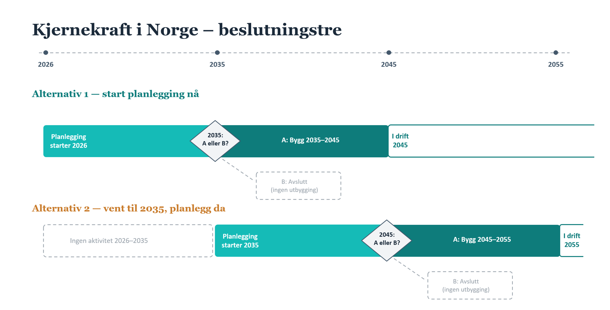

## Oppgavetekst
Lag en samfunnsøkonomisk nytte-kostnadsanalyse om bygging av kjernekraft i Norge. 

Analysen skal vurdere følgende alternativer:
  - Starte planleggingen nå og ta endelig beslutning i 2035
  - Utsette planleggingen til senere (for eksempel 2035) og ta endelig beslutning i 2055

Årstallene for endelig beslutning og planlegging er veiledende, og kan endres etter behov.

## Bakgrunn

Norge må ta stilling til om, og eventuelt når, det bør planlegges for kjernekraft. Regjeringens ekspertutvalg har nylig lagt fram sin utredning, [NOU 2026:4](https://www.regjeringen.no/no/dokumenter/nou-2026-4/id3155361/), som danner utgangspunktet for dette caset.

Beslutningen har en klar realopsjons-struktur: å starte planlegging nå gir Norge et kraftverk tidligere i drift, men til en investeringskostnad og med en teknologimodenhet som ennå er usikker. Å vente gir mer informasjon før beslutningen tas, men utsetter en eventuell gevinst og innebærer at man går glipp av tidlig produksjon.

## To måter verden kan utvikle seg

Fram mot beslutningstidspunktet kan den globale teknologimodningen for kjernekraft utvikle seg i to retninger, som her kalles **scenario A** og **scenario B**:

| | Scenario A – billig og enkelt | Scenario B – dyrt og komplisert |
|---|---|---|
| Design | Modne, standardiserte design (f.eks. SMR) | Fortsatt umodne leverandørkjeder |
| Erfaring | Erfaring fra internasjonale prosjekter reduserer risiko | Kostnadsoverskridelser og forsinkelser (jf. Olkiluoto 3, Vogtle) |
| Byggetid | Kort, forutsigbar byggetid | Lang, usikker byggetid |
| Investeringskostnad | Nær lønnsomhetsterskelen | Langt over lønnsomhetsterskelen |

## Beslutningstreet

## Kritiske faktorer

1. **Er alternativene i realiteten identiske bortsett fra tidspunkt?** Hvis den underliggende stasjonære sannsynligheten for scenario A vs. B er lik uansett når man planlegger, dominerer alternativ 1 rent tidsmessig: NV(alternativ 1) > NV(alternativ 2) på grunn av diskontering alene.
2. **Øker ventingen sannsynligheten for suksess?** Hvis det å vente til 2035 øker sannsynligheten for at teknologien har modnet til scenario A, kan dette snu rangeringen: NV(alternativ 1) < NV(alternativ 2).
3. **Øker strømprisen mye over tid?** Hvis strømprisen vokser raskere enn diskonteringsrenten, kan NV(alternativ 1) < NV(alternativ 2). Hvis mesteparten av prisøkningen derimot skjer *før* 2055, kan NV(alternativ 1) > NV(alternativ 2).
4. **Faller investeringskostnadene over tid?** Hvis investeringskostnadene forventes å falle fra 2045 til 2055, kan dette også gi NV(alternativ 1) < NV(alternativ 2).

Disse fire faktorene skal danne grunnlaget for studentenes kvantitative og kvalitative vurdering av de to alternativene.

## Informasjon som må innhentes

- Investeringskostnad
- Driftskostnad
- Byggetid
- Produksjon
- Levetid
- Fremtidig kraftpris
- Infrastruktur

Dere vil trolig kunne finne svar på alle disse punktene i [NOU 2026:4](https://www.regjeringen.no/no/dokumenter/nou-2026-4/id3155361/). 

