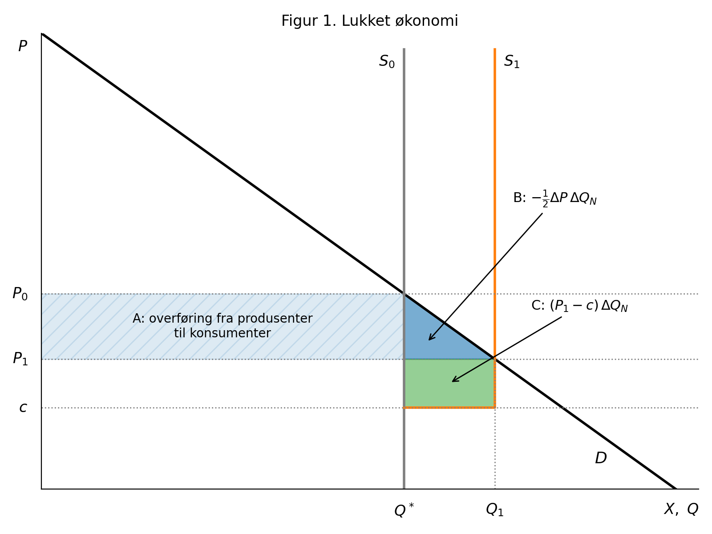
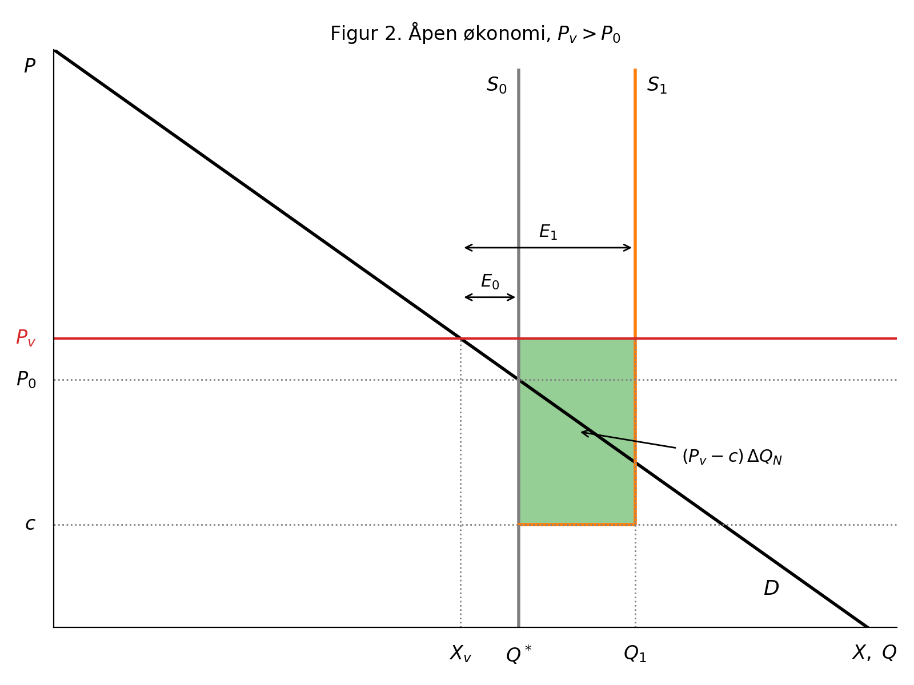
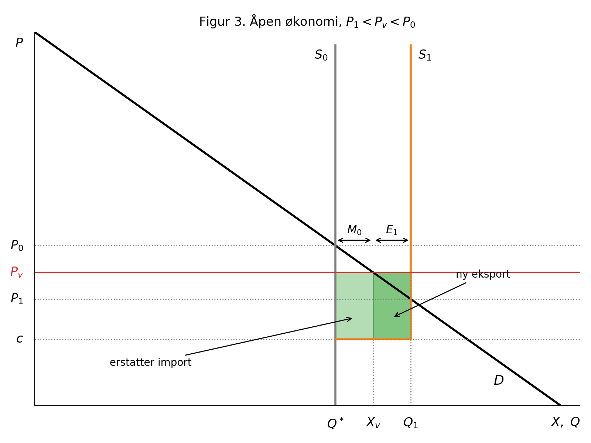

# Nytten av kjernekraft i Norge

## Innledning

Kjernekraftutvalgets utredning (NOU 2026: 4) drøfter kostnader, byggetid, sikkerhet, avfallshåndtering og kjernekraftens rolle i kraftsystemet, men konsumenter og konsumentoverskudd er ikke nevnt. Det er en vesentlig mangel. Nytten av økt kraftproduksjon avhenger av hvordan tiltaket påvirker kraftprisen, og dermed av hvordan gevinster og tap fordeler seg mellom konsumenter og produsenter. Vi ser først på en lukket økonomi og deretter på en åpen økonomi med en gitt verdensmarkedspris.

Gjennomgående antar vi at eksisterende vannkraft produserer på full kapasitet $Q^*$, fordi produksjonen er tilsigsbestemt. Kjernekraftverket øker produksjonen med $\Delta Q_N$ til en konstant enhetskostnad $c$, som omfatter annualisert investering. Etterspørselen er lineær, og $X$ betegner innenlandsk forbruk.

## 1 Lukket økonomi

Uten handel må forbruket være lik produksjonen. Før tiltaket er prisen $P_0$, der etterspørselen møter $Q^*$. Etter tiltaket er prisen $P_1$, der etterspørselen møter $Q_1 = Q^* + \Delta Q_N$. Prisendringen er $\Delta P = P_1 - P_0 < 0$.

Med lineær etterspørsel er endringen i konsumentoverskudd lik trapeset mellom gammel og ny pris (Boardman mfl., 2018, s. 57):

$$\Delta CS = -\Delta P\left(Q^* + \tfrac{1}{2}\Delta Q_N\right) = A + B$$

Eksisterende produsenter selger uendret volum til lavere pris, mens kjernekraftverket får $P_1 - c$ per enhet:

$$\Delta PS = \Delta P\,Q^* + (P_1 - c)\,\Delta Q_N = -A + C$$

Nytten er summen:

$$\Delta W = \Delta CS + \Delta PS = -\tfrac{1}{2}\Delta P\,\Delta Q_N + (P_1 - c)\,\Delta Q_N = B + C$$

som også kan skrives

$$\Delta W = \left(\frac{P_0 + P_1}{2} - c\right)\Delta Q_N$$

**Tolkning.** Rektangelet $A$ er en ren overføring: konsumentene betaler mindre for det de allerede kjøpte, og vannkraftprodusentene får tilsvarende mindre. Overføringen påvirker fordelingen, men ikke den samfunnsøkonomiske nytten. Nettonytten $B + C$ er arealet under etterspørselskurven mellom $Q^*$ og $Q_1$, minus kostnaden $c\,\Delta Q_N$. Hver ny enhet verdsettes altså til konsumentenes betalingsvillighet, som faller fra $P_0$ til $P_1$ og i gjennomsnitt er $(P_0 + P_1)/2$. Tiltaket er lønnsomt for samfunnet dersom $c < (P_0 + P_1)/2$.

**Privat og samfunnsøkonomisk lønnsomhet.** En investor i kjernekraftverket får bare $C$, altså $P_1 - c$ per enhet. Trekanten $B$ tilfaller konsumentene. Tiltaket kan derfor være samfunnsøkonomisk lønnsomt uten å være bedriftsøkonomisk lønnsomt. Er staten eier av både vannkraften og kjernekraftverket, blir statens inntektsendring $-A + C$, som kan være negativ selv om $\Delta W > 0$.

## 2 Åpen økonomi med verdensmarkedspris

Anta nå at Norge er en liten, åpen økonomi med ubegrenset overføringskapasitet til utlandet. Den innenlandske prisen er da lik verdensmarkedsprisen $P_v$, uansett hvor mye Norge produserer. Kjernekraftverket påvirker ikke prisen, slik at $\Delta P = 0$. Dermed er $\Delta CS = 0$, og eksisterende produsenter får ingen endring i overskudd.

### 2.1 Verdensmarkedsprisen over autarkiprisen: $P_v > P_0$

Før tiltaket forbruker Norge $X_v$, der etterspørselen møter $P_v$. Siden $P_v > P_0$, er $X_v < Q^*$, og Norge er nettoeksportør med $E_0 = Q^* - X_v$. Forbruket endres ikke når kjernekraftverket kommer, så all ny produksjon går til eksport: $E_1 = E_0 + \Delta Q_N$.

$$\Delta W = (P_v - c)\,\Delta Q_N$$

Hver ny enhet verdsettes til $P_v$, som er høyere enn både $P_0$ og gjennomsnittet $(P_0 + P_1)/2$ fra den lukkede økonomien. Nytten er derfor større enn uten handel. Konsumentene får ingen gevinst; hele nytten er eksportinntekter, altså økte krav på varer og tjenester i utlandet.

### 2.2 Verdensmarkedsprisen mellom de to autarkiprisene: $P_1 < P_v < P_0$

Siden $P_v < P_0$, er $X_v > Q^*$ før tiltaket, og Norge er nettoimportør med $M_0 = X_v - Q^*$. Siden $P_v > P_1$, er $Q_1 > X_v$ etter tiltaket, og Norge blir nettoeksportør med $E_1 = Q_1 - X_v$. De første $M_0$ enhetene fra kjernekraftverket erstatter import, og resten eksporteres.

$$\Delta W = (P_v - c)\,\Delta Q_N$$

Hver enhet som erstatter import, sparer Norge for $P_v$ i importutgifter. Hver enhet som eksporteres, gir $P_v$ i inntekt. Verdien per enhet blir derfor $P_v$ i begge tilfeller. Konsumentene betalte $P_v$ allerede før tiltaket og får ingen gevinst. Sammenlignet med lukket økonomi kan nytten være både høyere og lavere, avhengig av om $P_v$ ligger over eller under $(P_0 + P_1)/2$.

## 3 Oppsummering

| Tilfelle | $\Delta CS$ | $\Delta PS$ eksisterende | $\Delta PS$ kjernekraft | $\Delta W$ |
|---|---|---|---|---|
| Lukket økonomi | $-\Delta P\,(Q^* + \frac{1}{2}\Delta Q_N)$ | $\Delta P\,Q^*$ | $(P_1 - c)\,\Delta Q_N$ | $\left(\frac{P_0+P_1}{2} - c\right)\Delta Q_N$ |
| Åpen økonomi, gitt $P_v$ | $0$ | $0$ | $(P_v - c)\,\Delta Q_N$ | $(P_v - c)\,\Delta Q_N$ |

I en lukket økonomi verdsettes ny kraft til konsumentenes gjennomsnittlige betalingsvillighet, og prisfallet gir store overføringer fra produsenter til konsumenter. I en liten åpen økonomi verdsettes ny kraft til verdensmarkedsprisen, og det skjer ingen overføringer. Virkeligheten ligger mellom disse ytterpunktene: med begrenset overføringskapasitet påvirker ny produksjon også den norske prisen, og da oppstår både overføringer og tap på eksisterende eksport.

## Referanser

- Boardman, A. E., Greenberg, D. H., Vining, A. R. & Weimer, D. L. (2018). *Cost–Benefit Analysis: Concepts and Practice* (5. utg.). Cambridge University Press.
- NOU 2026: 4 (2026). *Kjernekraft i Norge? Fordeler, ulemper og forutsetninger*. Energidepartementet.
