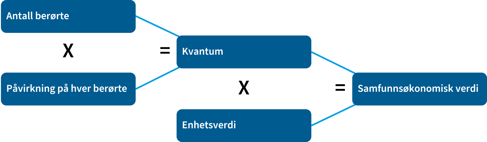
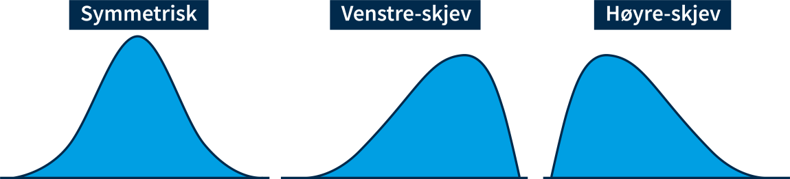

# Framgangsmåte for å vurdere virkninger

-   Alle positive og negative virkninger tallfestes så langt det lar seg gjøre
-   Dersom betalingsvilligheten \> summen av kostnadene:
    -   → Samfunnsøkonomisk lønnsomt.
-   Kostnadene ⇔ verdien av det en må gi opp av andre ting (alternativkostnad)
-   Nytten ⇔ hvor mye en er villig til å betale (folks samlede betalingsvillighet)
-   Flest mulig virkninger fastsettes i kroner

# Finn effekt, kvanta og pris, for å tallfeste virkningene

# Kvantum

-   Institusjoner
-   Personer
-   Bygg
-   ++ ...

# Metoder for å finne virkninger:

-   Estimere virkninger med empiriske data
-   Randomiserte kontrollerte forsøk
-   Naturlige eksperimenter
-   Lab-eksperimenter
-   Generell empirisk og teroretisk kunnskap
-   Tidligere analyser

# Enhetspris

-   Lønnsutgifter: Brutto reallønn inkl. arb.giveravg. og sosiale kostn.
-   Fritid: Netto inntekt etter skatt
-   Størst mulig grad markedspriser
-   Vareinnsats: Pris eksl. toll + avgifter, inkl. avgift+kvotepris som er korreksjon
-   Kvotekostnad uten CO-avgift brukes til kostnad ved klimagassutslipp
-   Verdien på et statistisk liv - 55 mill.
-   [Nyttig side fra statens vegesen](https://www.vegvesen.no/fag/publikasjoner/hoeringer/23-50086-20-horing-revidert-veileder-v712-konsekvensanalyser/)

# Beregn samfunnsøknomisk effekt

# Skattefinansieringskostnad

1.  Identifiser direkte netto virkningen på offentlige budsjetter
2.  Identifiser indirekte netto endring i beskatningsgrunnlaget og multipliser  med 45%
3.  Skattefinansieringskostnaden er 20% av 1 og 2

# Ikke prissatte virkninger

-   verdimatrisemetoden

| Kvantum / Enhetsverdi | Liten | Middels | Høy |
|-----------------------|-----------------|-----------------|-----------------|
| Stort negativt | Middels negativ | Stor negativ | Meget stor negativ |
| Middels negativt | Liten negativ | Middels negativ | Stor negativ |
| Lite negativt | Ubetydelig/ingen | Liten negativ | Middels negativ |
| Verken positivt eller negativt | Ubetydelig/ingen | Ubetydelig/ingen | Ubetydelig/ingen |
| Lite positivt | Ubetydelig/ingen | Liten positiv | Middels positiv |
| Middels positivt | Liten positiv | Middels positiv | Stor positiv |
| Stort positivt | Middels positiv | Stor positiv | Meget stor positiv |

# Vurder forventningsverdier

-   Summen av Sannsuynlighet \* kostnad

-   

    

# Vurdere samfunnsøkonomisk lønnsomhet

1.  Bruk nåverdimetoden for prissatte virkninger → ranger tiltakene
2.  Bruk verdimatrisemetoden til å sammenstille ikke-prissatte virkninger
3.  Ranger tiltakene basert på prissatte og ikke-prissatte virkninger

Beregn netto nåverdi

# Oppgave

1.  Hvordan er tiltakene rangert ihht. netto nåverdi?
    -   finn netto nåverdi for tiltakene som er vurdert
    -   er det bare ett, hvordan er det rangert ift. 0-alternativet
2.  Hvordan er ikke-prissatte virkninger vurdert?
3.  Påvirker ikke-prissatte virkninger rapportens anbefaling?